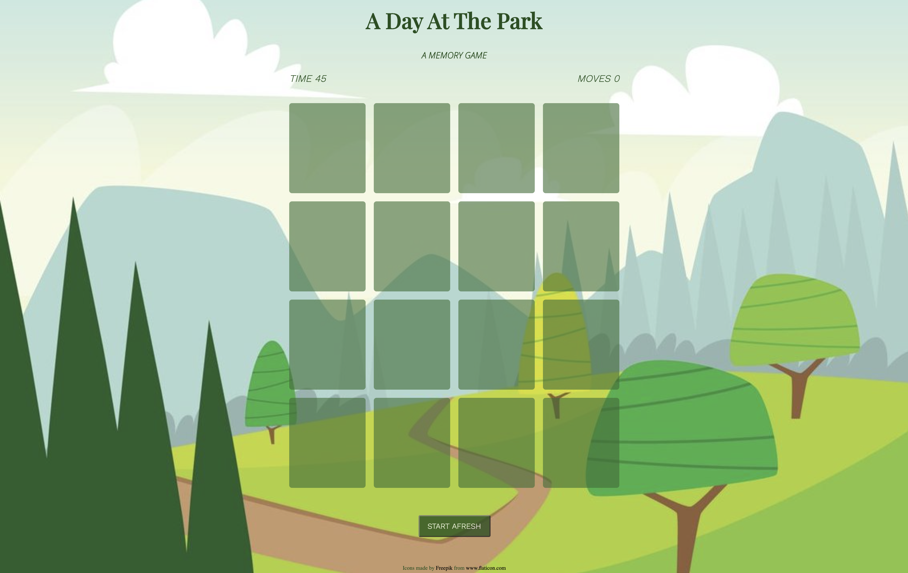

# A Day At The Park

## URL

<a href="http://www.google.com">include game url here</a>

## Description & Instructions

This is a simple pattern matching game. It is a card game in which all of the cards are laid face down on a surface and two cards are flipped face up over each turn. The object of the game is to turn over pairs of matching cards within 50 seconds. If you fail to do so, you can simply start afresh and go again!

## Screenshots

A memory game.

This is a simple card game where you need to match pairs by turning over 2 cards at a time. 

It starts out with the cards all flipped at the start, and you click on each card to flip them.
